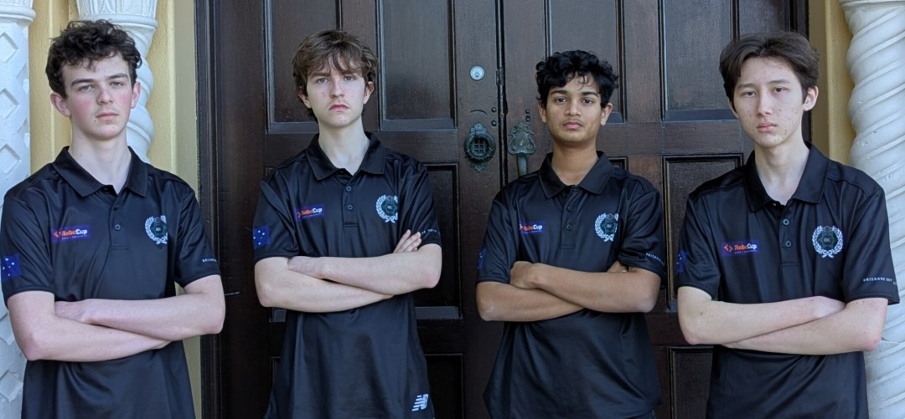

#  TEAM HYPERION 
### Brisbane Boys' College · RoboCup Junior Soccer Squad

  
   
  <b>Green. White. Black. Representing Australia.</b>

## 🤖 MISSION: BUILT TO COMPETE
Team Hyperion is a dedicated group of high school students (**Sam, Matthew, Luke, and Thomas**) from **Brisbane Boys' College** in Queensland, Australia. Originally competing internationally in Lightweight Soccer, we now compete in the **Soccer Vision League**—combining advanced robotics, autonomous alogorithms, custom sensor arrays, and precision engineering on the world stage.

---

## 🏆 ACHIEVEMENTS & COMPETITION HIGHLIGHTS

- **2026 RoboCup Junior International (Incheon, South Korea):**
  - **12th Place** — Individual Soccer (Improved ranking from 2025)
  - **4th Place** — SuperTeam Competition
- **2025 Australian National Competition:**
  - **Undefeated National Champions** — Reclaimed Australia's qualification spot for 2026
- **2025 RoboCup Junior International (Salvador, Brazil):**
  - **1st Place** — Lightweight SuperTeam World Champions
  - **14th Place** — Individual Lightweight Soccer

---

## 🚀 CURRENT CAMPAIGN (2026)
Having recently returned from the **2026 RoboCup Junior World Championship in Incheon, South Korea**, Team Hyperion is currently preparing for upcoming events, including the **Australian National Competition on the 3rd of October** in the Soccer Vision League.

---

## 🔗 CONNECT WITH US
Stay updated with our technical progress, media features, logbook, and competition results:

| Platform | Link |
| :--- | :--- |
| **🌐 Official Website** | [Visit Hyperion Online](https://team-hyperion-bbc-robotics.github.io/) |
| **📺 YouTube Channel** | [Watch Us Compete (@hyperion-bbcrobotics)](https://www.youtube.com/@hyperion-bbcrobotics) |
| **📓 Engineering Logbook** | [View Our Development Process](https://team-hyperion-bbc-robotics.github.io/logbook.html) |
| **✉️ Contact Email** | [bbchyperion@gmail.com](mailto:bbchyperion@gmail.com) |
| **📜 Legacy Sites** | [2024 Site](https://team-hyperion-bbc-robotics.github.io/2024) · [2025 Site](https://team-hyperion-bbc-robotics.github.io/2025) |

---

## 🛠️ THE TECHNOLOGY
Our custom-engineered robot stack is designed for high-speed autonomous play:
- **CAD & Mechanical Design:** Full 3D component renders in Fusion 360.
- **Lightweight League - Custom IR Ball Detection (Legacy Hardware):** TSSP77038 sensor ring tailored for direct IR tracking and direction strength processing under updated RCJ regulations.
- **Software & Vision:** Custom algorithms for ball tracking, autonomous navigation, and dynamic field positioning in the Soccer Vision League.

---

  <i>"This is College" — Representing Brisbane Boys' College on the World Stage</i>

